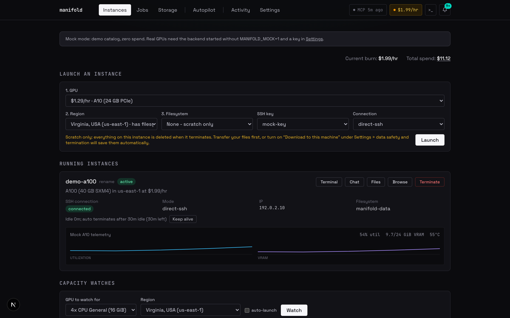
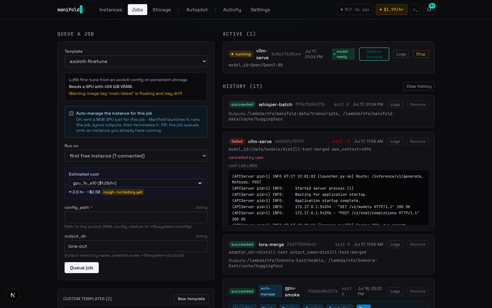
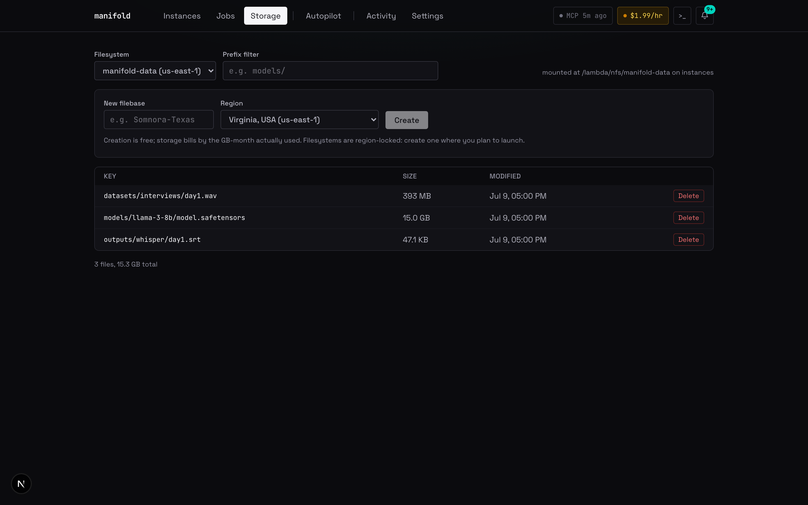
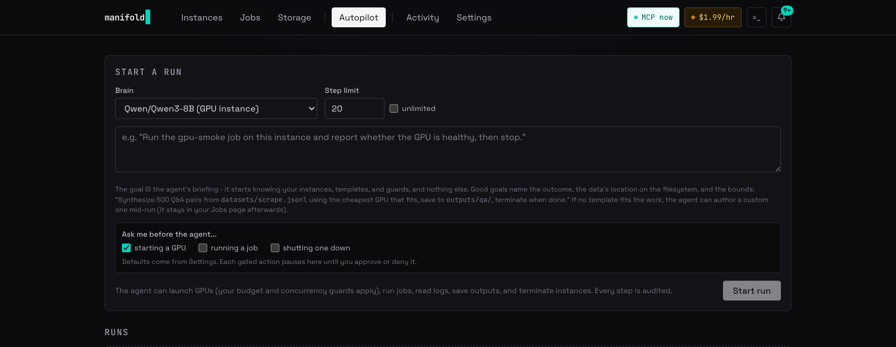

# Manifold

A local cockpit for Lambda Cloud GPUs: launch, work, and shut down without
ever losing a file or leaking a dollar. One guarded FastAPI backend owns
every action; a dashboard, a desktop app, and an MCP server for AI agents
are all thin clients of it.



## Try it in 90 seconds, no credentials

Mock mode runs the entire product against a simulated Lambda cloud: full
catalog, launches, jobs, terminals, telemetry. Zero spend, no API key.

```bash
# terminal 1: backend (from backend/)
uv sync
MANIFOLD_MOCK=1 uv run uvicorn app.main:create_default_app --factory

# terminal 2: dashboard (from dashboard/)
npm install && npm run dev    # then open http://localhost:3000
```

Launch an instance, queue a `vllm-serve` job, watch it go ready, open the
chat. Everything you see works identically against the real cloud once a
Lambda API key is pasted into Settings.

## Why it exists

Renting a GPU is easy. Renting one *safely* is not. Manifold's backend is
the single gateway for every action, and the guards live there, not in any
client:

- **Spend guards.** Budget cap, concurrency limit, and a live burn rate in
  the header. Idle instances auto-terminate (default 30 min, keep-alive one
  click away). Capacity watches can auto-launch the moment a region frees up.
- **Termination saves before it destroys.** Shutting down first rescues
  ephemeral files per your data-safety policy, and refuses if something
  could not be saved. There is exactly one explicit "burn it" override.
- **Nothing listens on the network.** GPU instances expose sshd and nothing
  else; model servers bind to loopback and are reached only through the
  managed SSH connection. The OpenAI-compatible proxy on your machine is the
  one public face.
- **Everything is audited.** Every launch, job, command, and agent tool call
  lands in one audit log.

## Jobs, not shell sessions

Work is YAML job templates run as supervised containers: `vllm-serve`,
`sglang-serve`, `whisper-batch`, `axolotl-finetune`, `llm-synthesize`,
`lora-merge`, `sdxl-generate`, `script-run`, and more. Jobs stream logs,
survive backend restarts, and can auto-manage their own instance: rent a
GPU, run, sync outputs, terminate.



The whole distillation loop is templates end to end: `llm-synthesize`
(teacher writes a training set) -> `axolotl-finetune` (LoRA on the student)
-> `lora-merge` (fold the adapter into a standalone model) -> `vllm-serve`
(serve your model by path). See `docs/distill-your-own-model.md`.

Persistent filesystems are first-class: browse, upload, download, and create
new filebases in any region from the Storage page.



## Built for AI agents

Any MCP client (Claude Code, Claude Desktop, Codex, Gemini CLI) gets 20
tools that flow through the same guarded backend, so an agent hits the same
budget walls you do. With the desktop app installed, registration is one
line, no dev checkout:

```bash
claude mcp add manifold -- "/Applications/Manifold.app/Contents/MacOS/manifold-backend" --mcp
```

The agent's first call, `get_skill`, returns a playbook of recipes (launch,
serve, batch, fine-tune, teardown) and the rules that keep GPU work safe.
Full setup for every client: `docs/mcp-setup.md`.

There is also Autopilot, an agent loop that runs *inside* Manifold, driven
by any brain: a model served on your own instance, a local Ollama or
LM Studio model, or a frontier API. Spend actions pause for your approval.



And the OpenAI-compatible proxy at `localhost:8000/v1` points any existing
tool (aider, opencode, your own scripts) at a model served on your GPU. A
running serve job's card has an "Open in terminal" button that opens a local
shell already wired to it.

## Desktop app

One .dmg: a Tauri shell around the same backend with the dashboard bundled.
First run asks for your Lambda API key, validates it, and stores it locally.
Build instructions: `docs/desktop-build.md`.

## Layout

- `backend/` FastAPI orchestrator (Python 3.11+, SQLite, asyncssh)
- `dashboard/` Next.js dashboard
- `templates/` bundled YAML job templates
- `docs/` user guides (MCP setup, distillation, data pipelines, proxy)
- `DECISIONS.md` running log of every non-obvious choice and why
- `CLAUDE.md` build/run/test reference

## Development

```bash
cd backend
uv sync
uv run pytest          # 430+ tests, all against mocks; no live spend
```

Hard rules: no live spend in tests, all guards live in the backend, clients
never get a path around them. The full list is in `CLAUDE.md`, and
`CONTRIBUTING.md` explains how to work with them.

## License

MIT — see `LICENSE`.
